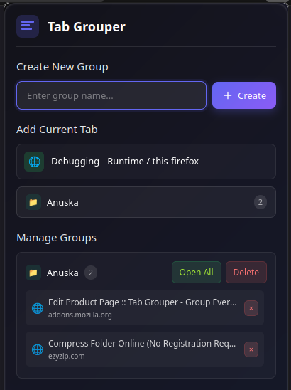

# Tab Grouper - Organize Your Browsing Experience 🌐📂

A beautiful, intuitive browser extension that helps you organize your tabs into customizable groups with a sleek dark-mode interface. Perfect for power users, researchers, and anyone who deals with tab overload!

## Features ✨

- **Group tabs by project, topic, or workflow**
- **One-click save current tab** to any group
- **Open entire groups** with a single click
- **Mobile & desktop optimized** experience
- **Dark glassmorphism UI** with smooth animations
- **Right-click context menu** integration
- **Cross-browser support** (Chrome, Firefox, Edge)
- **Keyboard shortcuts** for quick access
- **No telemetry** - Your data stays private

## Installation 🛠️

### Browser Extension Stores
- **Firefox Add-ons**: [Install Link](https://addons.mozilla.org/en-US/firefox/addon/group-open-tabs)
- **Chrome Web Store**: [Upcoming](#)

### Manual Installation
1. Download or clone this repository
2. Open your browser's extension management page:
   - Chrome: `chrome://extensions`
   - Firefox: `about:addons`
3. Enable "Developer mode"
4. Click "Load unpacked" and select the extension directory

## How to Use 🖱️

### Basic Usage
1. Click the extension icon in your toolbar
2. Create a new group by entering a name
3. Click any group to save your current tab
4. Manage groups in the "Manage Groups" section

### Advanced Features
- **Right-click** on any page to quickly add to groups
- **Open all tabs** in a group simultaneously